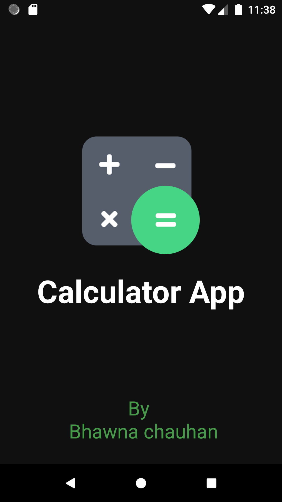
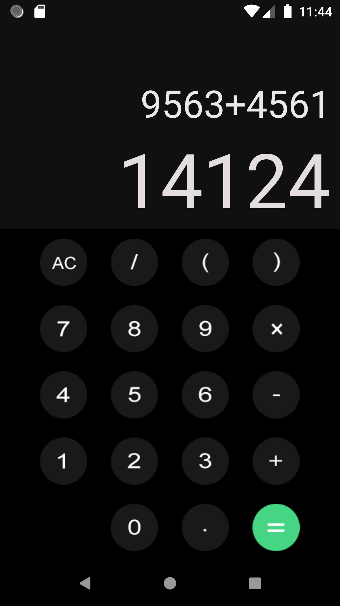

<h1 align="center">CALCULATOR
<h3 align="centre"> 
     Hope you all are doing well 
</h3> 

<h3 align ="centre">Let's create this project with me</h3>

# Prerequisite
* Android Studio installed in your system.
   

🚀 Language used in creating this is Kotlin 

⚡**UI** of Calculator
 

 

### 🙋‍♂️ Hope you like my app .If you like don't forget to like the repository  

<h2 align= "centre">If you are facing any issue then free to contact me through email</h2>

- 📫Email : bhawnabc2002@gmail.com

